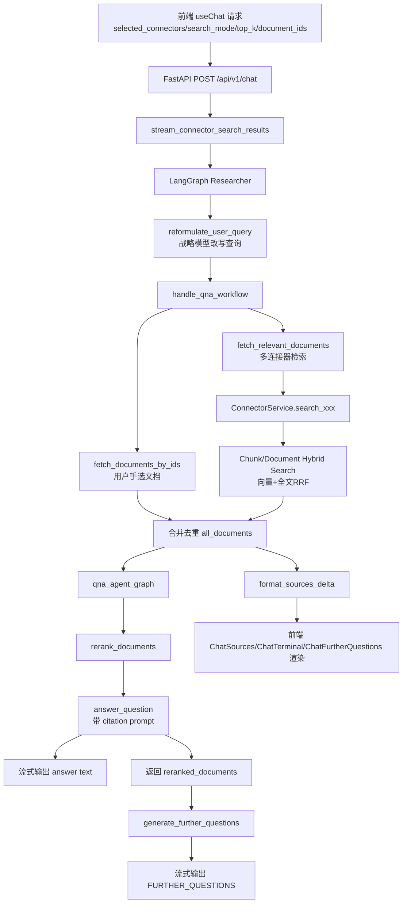
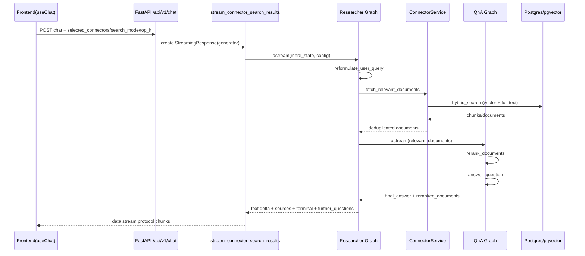
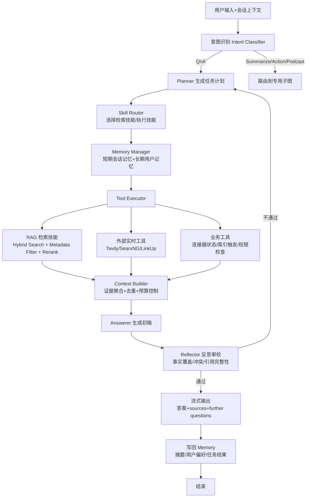

# SurfSense Agent 工程说明（Markdown 版）

- 版本：v1.0
- 日期：2026-03-11
- 适用范围：`surfsense_backend` + `surfsense_web` 的 Researcher Agent 主链路

## 1. 项目目标

SurfSense 的 Researcher Agent 目标是：

1. 从多源个人知识库（文件、Slack、Notion、GitHub、Jira、外部搜索等）检索相关证据。
2. 通过混合检索（向量 + 全文）与重排，生成带引用的高质量回答。
3. 以流式形式返回给前端：过程日志、来源列表、正文增量、后续问题建议。
4. 在现有架构基础上，向「意图识别、规划、反思、Tool/Skill/Memory」增强路线演进。

---

## 2. 当前已实现工作流（As-Is）

### 2.1 请求与入口

前端通过 `useChat` 向 `/api/v1/chat` 发起流式请求，并带上：

- `selected_connectors`
- `search_mode`（`CHUNKS` / `DOCUMENTS`）
- `document_ids_to_add_in_context`
- `top_k`

后端路由层负责鉴权、参数校验、语言与空间配置装载，然后进入 `stream_connector_search_results`。

### 2.2 Researcher 主图

主图是线性 3 节点：

1. `reformulate_user_query`
2. `handle_qna_workflow`
3. `generate_further_questions`

特点：

- 已有“意图保持式查询改写”（通过 strategic LLM），但还不是显式意图分类器。
- 执行路径固定，尚未引入分支规划与反思回路。

### 2.3 检索与回答

`handle_qna_workflow` 内部处理：

1. 拉取用户手选文档（若有）。
2. 对每个 connector 执行检索：本地索引源走 hybrid search，外部源走 API。
3. 合并、去重并形成 `all_documents`。
4. 进入 `qna_agent_graph`：
   - `rerank_documents`
   - `answer_question`
5. 回答过程中流式输出正文增量。
6. 回答后用重排文档生成 follow-up questions。

### 2.4 RAG 技术栈（当前）

- 入库：ETL 解析 -> 文档摘要 -> 分块 -> 向量化 -> 存储。
- 检索：向量召回 + PostgreSQL 全文检索（tsvector/tsquery）+ RRF 融合。
- 重排：可选 `reranker`（环境开关控制）。
- 生成：QnA prompt 支持 citations 与 custom instructions。

RRF 形式：

$$
score(d) = \frac{1}{k + r_{semantic}(d)} + \frac{1}{k + r_{keyword}(d)}
$$

### 2.5 Researcher 组件分层（代码映射）

为便于评审和二次开发，可以把 Researcher 运行时拆成 8 层：

1. 请求入口层
   - `app/routes/chats_routes.py`
   - 负责鉴权、参数校验、组装流式响应
2. 任务封装层
   - `app/tasks/stream_connector_search_results.py`
   - 负责把 request body 转成 graph `configurable` + `State`
3. 主编排图层（Researcher）
   - `app/agents/researcher/graph.py`
   - 线性节点：改写 -> QnA -> 后续问题
4. 子编排图层（QnA Agent）
   - `app/agents/researcher/qna_agent/graph.py`
   - 节点：rerank -> answer
5. 检索聚合层
   - `app/agents/researcher/nodes.py` 中 `fetch_relevant_documents`
   - `app/services/connector_service.py`
6. 检索算子层
   - `app/retriver/chunks_hybrid_search.py`
   - `app/retriver/documents_hybrid_search.py`
7. 质量增强层
   - `app/services/reranker_service.py`
   - `app/agents/researcher/utils.py`（token 预算裁剪）
8. 流式协议层
   - `app/services/streaming_service.py`
   - 向前端发 terminal/sources/text/further_questions 注解

### 2.6 Researcher 配置与状态模型

### 2.6.1 Configuration（入参契约）

`app/agents/researcher/configuration.py` 关键字段：

- `user_query`: 用户原始问题
- `connectors_to_search`: 本轮检索的连接器集合
- `search_space_id`: 作用域（多租户核心边界）
- `search_mode`: `CHUNKS` 或 `DOCUMENTS`
- `document_ids_to_add_in_context`: 用户手选文档
- `language`: 回复语言
- `top_k`: 每连接器召回深度

### 2.6.2 State（运行态）

`app/agents/researcher/state.py`：

- `db_session`: 数据库上下文
- `streaming_service`: 流式输出格式器
- `chat_history`: 会话短期记忆
- `reformulated_query`: 改写后的检索 query
- `reranked_documents`: QnA 子图回传的高相关文档
- `final_written_report`: 最终回答
- `further_questions`: 后续建议问题

这意味着当前“记忆”主要是会话短期记忆（chat_history），尚无长期用户记忆表与召回流程。

### 2.7 节点 I/O 契约（当前实现）

### 2.7.1 主图节点

1. `reformulate_user_query`
   - 输入：`user_query` + `chat_history`
   - 输出：`reformulated_query`
   - 依赖：`QueryService.reformulate_query_with_chat_history`

2. `handle_qna_workflow`
   - 输入：`reformulated_query` + `connectors_to_search` + `document_ids_to_add_in_context`
   - 输出：`final_written_report` + `reranked_documents`
   - 关键子步骤：
     - 手选文档装载
     - 连接器检索与去重
     - 调用 qna 子图并流式透传回答增量

3. `generate_further_questions`
   - 输入：`chat_history` + `reranked_documents`
   - 输出：`further_questions`（JSON 数组）
   - 依赖：fast LLM

### 2.7.2 QnA 子图节点

1. `rerank_documents`
   - 输入：`relevant_documents`
   - 输出：`reranked_documents`
   - 降级：无 reranker 时原顺序返回

2. `answer_question`
   - 输入：`reranked_documents` + `user_query`
   - 输出：`final_answer`
   - 关键行为：
     - 依据 SearchSpace 配置拼接 citation/custom prompt
     - token 预算裁剪（超窗时裁文档）
     - 生成带 citation 回答

### 2.8 端到端时序（Researcher）

### 2.9 流式数据面（前后端协议）

当前流式协议由 `StreamingService` 负责，核心事件：

1. `TERMINAL_INFO`
   - 展示 Agent 处理进度
2. `sources`
   - 以节点数组返回来源，前端按 `source_type/group_name` 聚合
3. `text chunk`
   - 回答正文增量
4. `FURTHER_QUESTIONS`
   - 建议问题数组

前端对应渲染组件：

- `ChatTerminal.tsx`
- `ChatSources.tsx`
- `ChatFurtherQuestions.tsx`

### 2.10 失败处理与降级策略（已实现）

1. 单连接器失败不会中断全链路
   - 失败 connector 记录 error 并继续其余连接器
2. 无文档时继续回答
   - QnA 使用 no-documents prompt，避免空响应
3. 无 reranker 自动降级
   - 使用原始相关性顺序
4. token 超预算自动裁剪
   - 基于文档 token 成本做二分裁剪
5. 后续问题解析失败
   - 返回空数组而不影响主回答

这些策略使当前架构“可用性优先”，对线上噪声与局部故障具备一定韧性。

---

## 3. 目标技术路线（To-Be）

### 3.1 意图识别

新增 `detect_intent` 节点，输出结构化结果：

- `intent`: 如 `qna`, `incident_analysis`, `comparison`, `summary`, `podcast`
- `confidence`
- `needs_web`
- `needs_memory`
- `priority`

### 3.2 规划与执行

新增 `planner` 节点，把任务拆为可执行步骤（step list）。

- 例：`retrieve_local` -> `retrieve_external` -> `cross_check` -> `compose_answer`
- 执行由 Tool Executor 依次调用 skill/tool，写入 `execution_trace`。

### 3.3 反思（Reflection）

新增 `reflector` 节点，自动检查：

1. 关键子问题覆盖率
2. 引用完整性
3. 冲突证据处理
4. 不确定性披露

若未通过，回到 planner 补检索/补验证后再输出。

### 3.4 Tool / Skill 抽象

把现有能力封装为 skill：

- `local_rag_skill`：本地知识库检索（hybrid + rerank）
- `web_search_skill`：Tavily/SearxNG/LinkUp
- `connector_skill`：连接器结构化检索
- `ops_skill`：索引状态、权限校验、数据可用性检查

### 3.5 Memory 分层

- 短期记忆（Session）：当前 chat_history 与中间计划状态。
- 长期记忆（Long-term）：用户偏好、稳定事实、常见上下文。
- 写回策略：高价值且可复用的信息才入长期记忆。

---

## 4. 数据处理闭环

## 4.1 入库链路（Indexing）

1. 连接器触发索引任务（异步 Celery）。
2. 拉取源数据并标准化为文档文本。
3. 生成 `unique_identifier_hash` / `content_hash` 做去重与增量更新。
4. 文档摘要生成（用于文档级表示）。
5. 文本分块（chunker）与向量化（embedding）。
6. 写入 `Document` / `Chunk`（pgvector）。

## 4.2 查询链路（Serving）

1. 接收用户 query + connector 配置。
2. 查询改写（保持用户意图）。
3. 多源并行检索（本地索引 + 外部 API）。
4. RRF 融合、去重、重排。
5. 组装上下文并做 token 预算裁剪。
6. 生成回答（citation）。
7. 生成后续问题。
8. 流式返回：terminal info / sources / text / further questions。

---

## 5. 代表性案例（每步含数据处理）

## 案例 A：发布复盘（Slack + Jira + Notion）

用户问题：上周发布被阻塞的关键原因是什么？

1. 输入阶段
   - 原始 query + `selected_connectors=[SLACK, JIRA, NOTION]`
2. 改写阶段
   - 生成更具体检索词：版本号、时间窗口、故障关键词
3. 检索阶段
   - Slack 拉讨论片段，Jira 拉 issue 流转，Notion 拉复盘页
4. 融合重排
   - 统一字段，去重，按相关度与时间排序
5. 生成回答
   - 输出“阻塞点 -> 根因 -> 修复动作”并附 citation
6. 后续问题
   - 自动建议：是否需要按团队/模块拆分复盘？

数据变化：

- 原始消息 -> 标准化 chunk -> 证据集合 -> 引用答案

## 案例 B：跨源冲突核验（GitHub vs Gmail）

用户问题：PR 说修复了，为什么客户邮件还在报错？

1. 输入阶段
   - query + `selected_connectors=[GITHUB, GOOGLE_GMAIL]`
2. 检索阶段
   - GitHub：提交与合并时间
   - Gmail：报错邮件时间与描述
3. 对齐阶段
   - 按时间线合并，构建冲突视图
4. 回答阶段
   - 给出可能解释：修复未部署、灰度未覆盖、回滚等
5. 反思扩展（To-Be）
   - 若证据不足，自动补检索日志/监控源

数据变化：

- 两条证据链 -> 时间轴对齐 -> 冲突解释 -> 可执行排查建议

## 案例 C：知识缺口场景（本地命中不足）

用户问题：新政策变化对我们项目的影响？

1. 本地 RAG 检索
   - 命中不足
2. 外部检索补充（To-Be 规划）
   - 自动调用 web search skill
3. 证据分层
   - 区分“个人知识库证据”与“外部证据”
4. 输出
   - 明确哪些结论高置信，哪些需人工确认
5. 记忆写回（To-Be）
   - 记录知识缺口，提示后续补充数据源

---

## 6. 分阶段落地建议

1. Phase 1（低风险）
   - 增加 `detect_intent` + `planner` 节点
   - 不改现有 ConnectorService，仅做编排层增强
2. Phase 2（质量提升）
   - 增加 `reflector` 回路
   - 增加计划可视化流式注解
3. Phase 3（长期价值）
   - 增加长期 memory 存储与召回策略
   - skill 注册中心 + tool 调度治理

---

## 7. 交付物说明

本次提供双版本说明文档：

1. Markdown 版：适合代码评审、版本管理、PR 协作。
2. HTML 版：适合非研发同学浏览、演示与对外分享。

